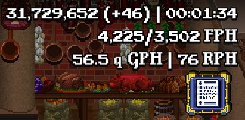
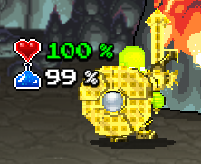

# Caviar

Caviar is a Soda Dungeon 2 MOD that adds only the finest things in life.

# Features

Caviar has many features that will not only improve your quality of life, but will also show you information you did not even know you wanted to know.

There are two types of features in Caviar: Core Features and Experimental Features. Core Features will persist between updates while Experimental Features may be deprecated.

## Core Features

### Adventure UI

- Current bonus warps
- Current adventure time
- Gold per hour (GPH)
- Essence per hour (EPH) **[COMING SOON]**
- Stein relics per hour (RPH)
  - Only appears when a relic has been earned
- Stein gold find relics per hour (GFR)
  - Only appears when a gold find relic has been earned
- Character HP and MP show as a percentage

### Relic UI

- +10k level-up button
- +100k level-up button
- Max level-up button
  - Note: This can take a while to process (ex, 1.5M levels took around 3s)

### Scripts UI

- Half-height script triggers **[COMING SOON]**
- Scripts sorted by script name **[COMING SOON]**

### Book UI

- Scripts sorted by script name **[COMING SOON]**

## Experimental Features

### Adventure UI

- Number of heals **[DEPRECATED]**
- Number of ambushes **[DEPRECATED]**
- Number of portals **[DEPRECATED]**

# Screenshots

## Adventure UI

## Relic UI

# Instructions

Installing and uninstalling Caviar is super easy. Just follow the instructions below and you'll be fine...

## Installing

Installing Caviar is as easy as counting to 3.

1) Download the version of Caviar that you want (preferablly the latest release).
2) Find your Soda Dungeon 2 installation folder.
   - This is typically found here: `C:\Program Files (x86)\Steam\steamapps\common\Soda Dungeon 2\SodaDungeon2_Data\Managed`.
3) Copy the downloaded dll into the directory from step 2.

## Uninstalling

Uninstalling Caviar is super simple.

1) Open Steam.
2) Find Soda Dungeon 2 in your massive game list.
3) Right-click Soda Dungeon 2 and click `Properties`.
4) Click `Local Files`
5) Click `Verify integrity of game files...`.
6) Follow the prompts.

# FAQ

You've got questions? Well I have answers.

### Q. I want th-

I don't care what you want. The answer is no.

### Q. I want features from MOD X in MOD Y, can I ha-

I said no.

# Remarks

I take no responsibility for anything you do. Always make a backup of the original dll and your save data before using the Caviar MOD, or any MOD.

# Credits

A big thanks to Shawn for creating this game.