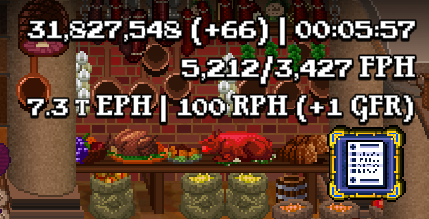
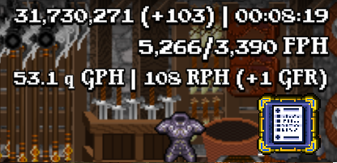
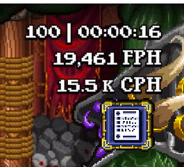
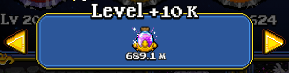
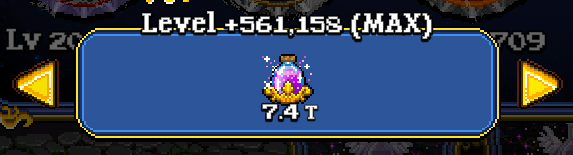
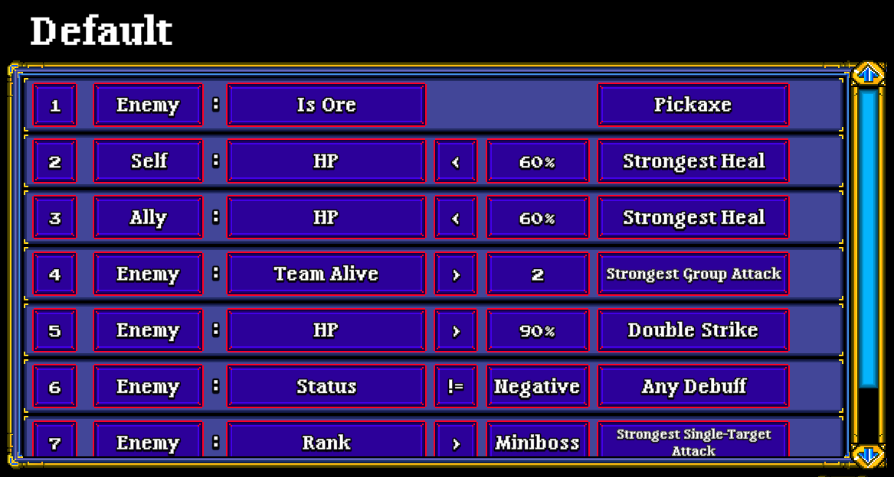

# Caviar

Caviar is a Soda Dungeon 2 MOD that adds only the finest things in life.

# Features

Caviar has many features that will not only improve your quality of life, but will also show you information you did not even know you wanted to know.

## Core Features

### Adventure UI

- Current bonus warps
- Current adventure time
- FPH/FPH-warps
  - Displays both FPH at the same time
  - Displays only a single FPH if warps have not been used
- Gold per hour (GPH)
  - Clicking GPH shows EPH
- Essence per hour (EPH)
  - Clicking EPH shows GPH
- Credits per hour (CPH) **[beta-only]**
  - Shows only during Boss Rush
- Stein relics per hour (RPH)
  - Shows when a free relic has been earned
- Stein gold find relics per hour (GFR)
  - Shows when a free gold find relic has been earned

### Relic UI

- +10k level-up button
- +100k level-up button
- Max level-up button
  - Note: This can take a while to process (ex, 1.5M levels took around 3s)

### Scripts UI

- Half-height script triggers
- Scripts sorted by script name

### Book UI

- Scripts sorted by script name

## Deprecated Features

The following features have been removed due to either being unnecessary, or were not entirely thought out.

### Adventure UI

- Character HP and MP show as a percentage
  - Note: This was removed because it was not fully thought out and it may make a return in the future.

# Screenshots

## Adventure UI

## Relic UI

## Soda Scripts UI

# Instructions

Installing and uninstalling Caviar is super easy. Just follow the instructions below and you'll be fine...

## Installing

Installing Caviar is as easy as counting to 3.

1) Download the version of Caviar that you want (preferablly the latest release).
   - Note: Caviar is versioned the same as the game's version. To find the correct version, I'm the title screen on the game click the version number at the bottom to get the build number. This number is the version of Caviar to download.
   - Download the `Assembly-CSharp.dll` file from the releases section.
2) Find your Soda Dungeon 2 installation folder.
   - This is typically found here: `C:\Program Files (x86)\Steam\steamapps\common\Soda Dungeon 2\SodaDungeon2_Data\Managed`.
3) Copy the downloaded dll into the directory from step 2.

## Uninstalling

Uninstalling Caviar is super simple.

1) Open Steam.
2) Find Soda Dungeon 2 in your massive game list.
3) Right-click Soda Dungeon 2 and click `Properties`.
4) Click `Local Files`
5) Click `Verify integrity of game files...`.
6) Follow the prompts.

# Known Issues

## Boss Rush

The EPH/GPH display shows when it shouldn't.

# FAQ

You've got questions? Well I have answers.

### Q. I want th-

I don't care what you want. The answer is no.

### Q. I want features from MOD X in MOD Y, can I ha-

I said no.

# Remarks

I take no responsibility for anything you do. Always make a backup of the original dll and your save data before using the Caviar MOD, or any MOD.

# Credits

A big thanks to Shawn for creating this game.
